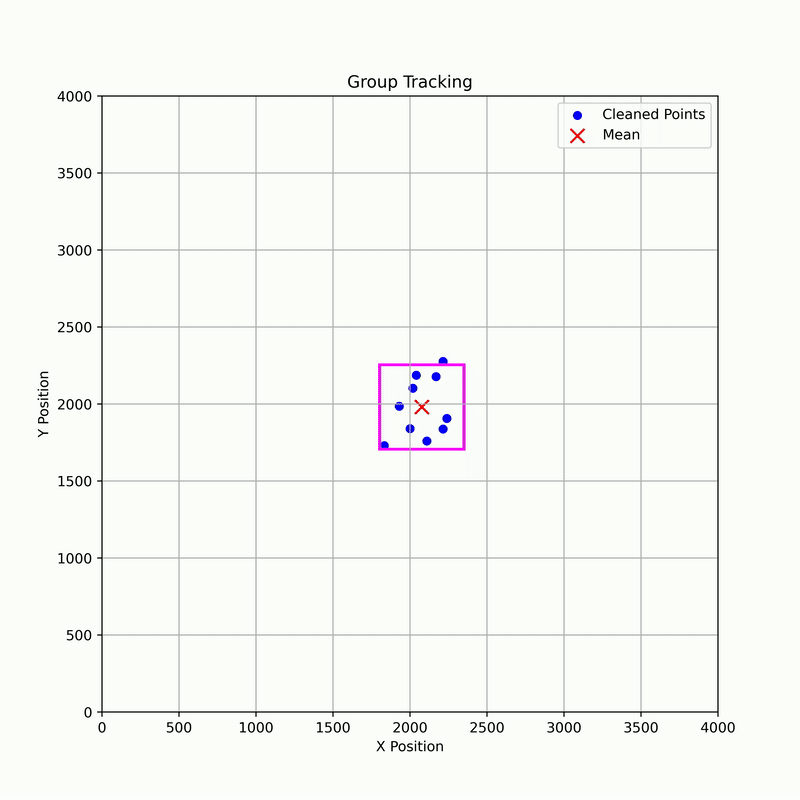

# Group Tracking

This project implements an algorithm to automatically track a group of objects in real-time using any object detection algorithms, clustering and Gaussian modeling for robust tracking, and bounding square visualization for camera control.

## Features
### The inputs of this algorithm is the 2D position of the objects. And the output is mean and covariance of a 2D Gaussian distribution. Mean is used to follow the objects group and covariance is for zoom control.
- DBSCAN clustering and outlier removal
- 2D Gaussian distribution fitting
- Axis-aligned bounding square for camera framing and control
- Visualization and video output support

## Usage
See `main.py` for example usage.

## Results

